<h1 align="center"> Code4Health </h1>

<p align="center">
  
</p>

<p align="center">
  Un asistente de compras inteligente diseñado para ayudarte a tomar decisiones más saludables en el supermercado.
</p>

---

## 📝 Descripción

**Code4Health** es una aplicación móvil desarrollada en Flutter que funciona como un **Asistente de Compras Inteligente**. El objetivo principal de la app es combatir la crisis de obesidad y sobrepeso, permitiendo a los usuarios escanear códigos de barras de productos para obtener información nutricional detallada, advertencias, y alternativas más saludables, todo basado en sus objetivos de salud y perfil personal.

---

## ✨ Características

* 🔐 **Autenticación de Usuarios:** Registro e inicio de sesión seguros.
* 👤 **Perfil de Salud:** Recopilación de datos del usuario (edad, peso, altura, condiciones, datos cardiovasculares).
* 📱 **Gestión de Perfil:** Visualización y edición de toda la información de salud del usuario.
* 📷 **Escáner de Código de Barras:** Usa la cámara del dispositivo para escanear productos en tiempo real.
* 📊 **Información de Productos:** Muestra información detallada del producto escaneado.
* 📚 **Historial de Escaneos:** Guarda un registro de todos los productos consultados para referencia futura.

---

## ✨ Proximas Características
* 👤 **Perfil de Salud Personalizado:** Recopilación de datos del usuario (edad, peso, altura, condiciones, datos cardiovasculares) para ofrecer recomendaciones a medida.
* 📱 **Visualización de Perfil Cardiovascular:** Visualización de información de salud cardiovascular.
* 📊 **Análisis de Productos:** Muestra información detallada del producto escaneado, indicando si se ajusta a las necesidades dietéticas del usuario.
* 💡 **Sugerencias de Productos:** Muestra alternativas más saludables de productos escaneados.

---

## 📱 Pantallas

<table>
  <tr>
    <td align="center">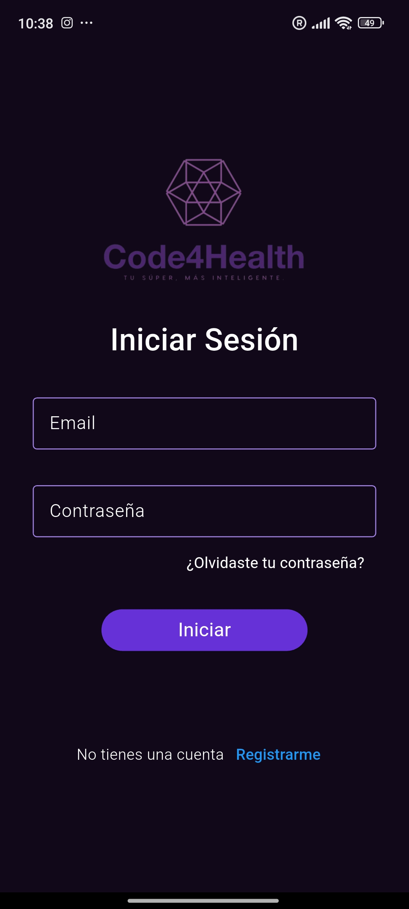<br><sub><b>Inicio de Sesión</b></sub></td>
    <td align="center">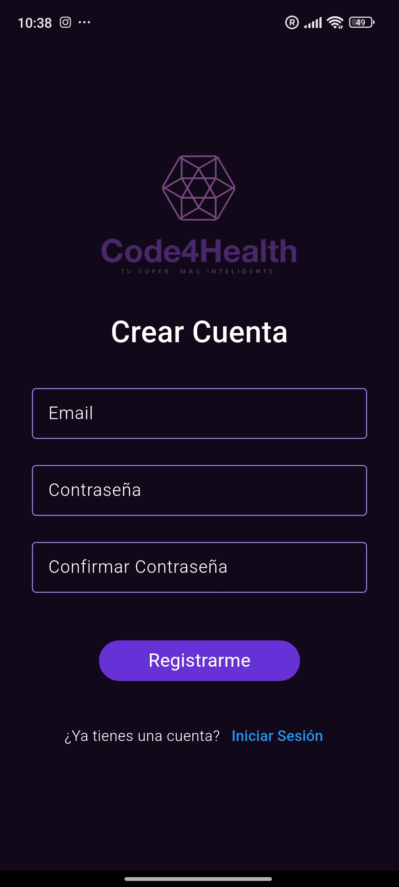<br><sub><b>Crear Cuenta</b></sub></td>
    <td align="center"><br><sub><b>Restablecer Contraseña</b></sub></td>
    <td align="center">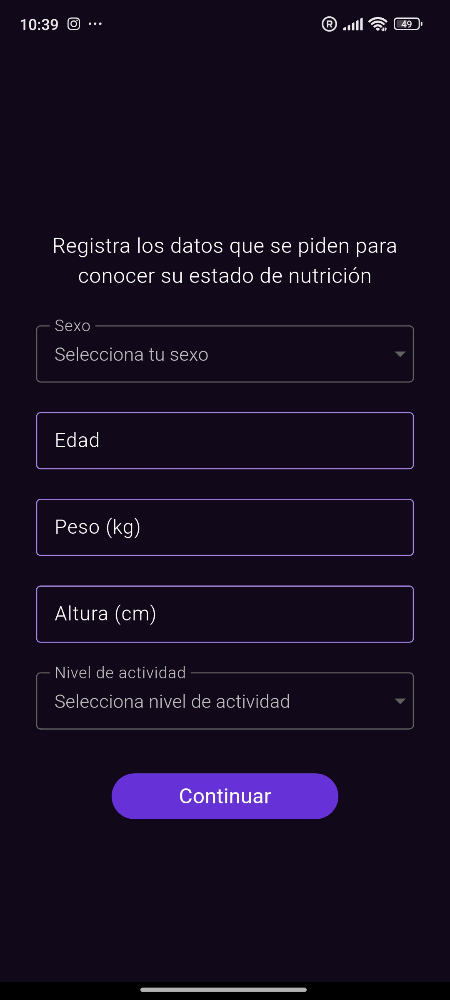<br><sub><b>Datos nutricionales</b></sub></td>
    <td align="center">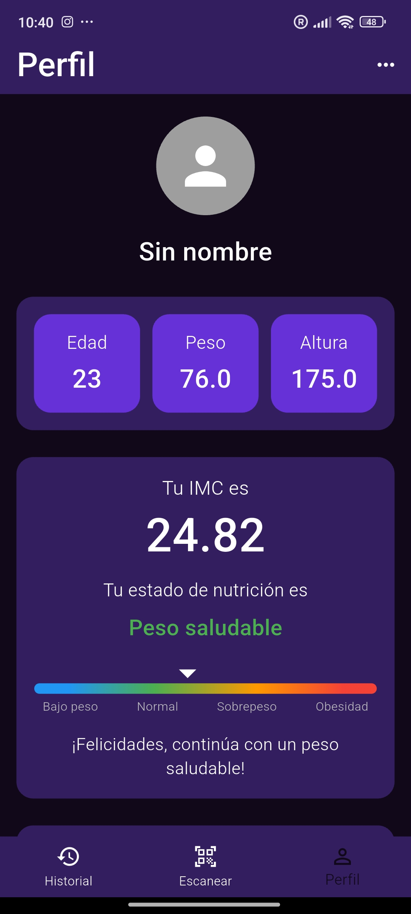<br><sub><b>Perfil de Usuario</b></sub></td>
  </tr>
  <tr>
    <td align="center">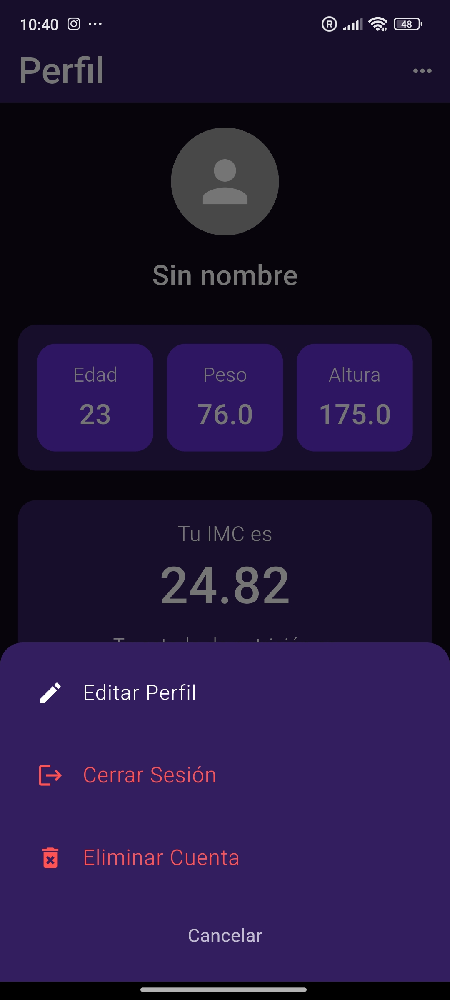<br><sub><b>Opciones de Cuenta</b></sub></td>
    <td align="center">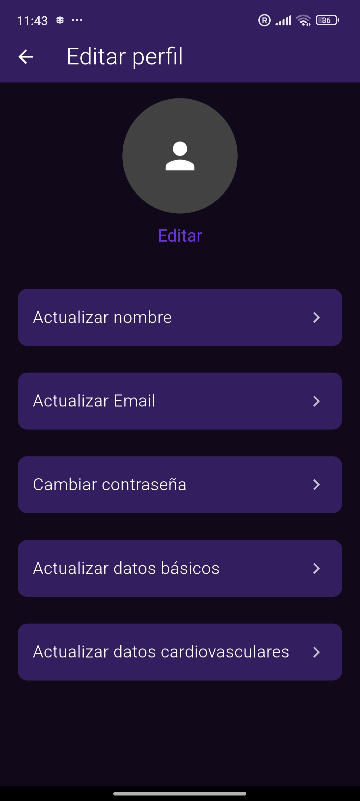<br><sub><b>Editar perfil</b></sub></td>
    <td align="center"><br><sub><b>Actualizar Nombre</b></sub></td>
    <td align="center"><br><sub><b>Actualizar Email</b></sub></td>
    <td align="center"><br><sub><b>Actualizar Contraseña</b></sub></td>
  </tr>
   <tr>
    <td align="center">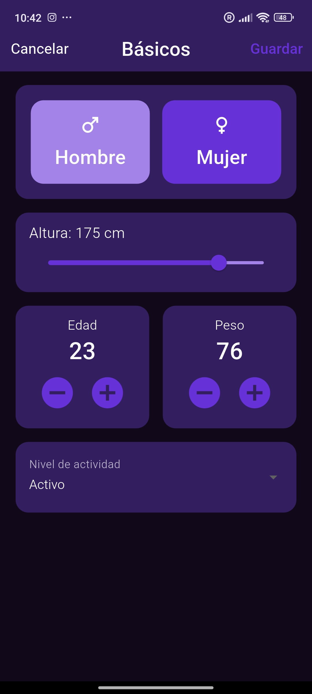<br><sub><b>Actualizar Datos Nutricionales</b></sub></td>
    <td align="center">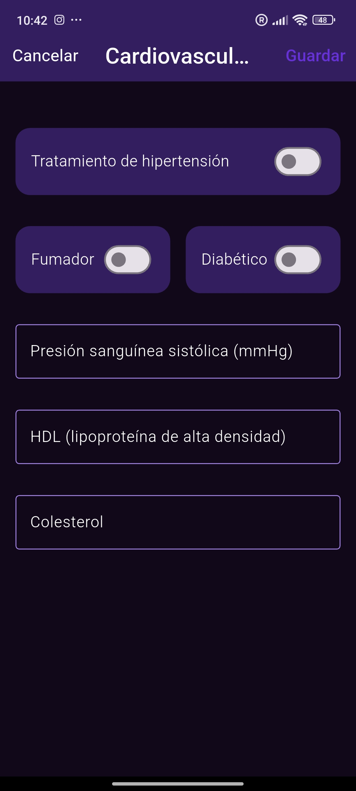<br><sub><b>Actualizar Datos Cardiovasculares</b></sub></td>
    <td align="center">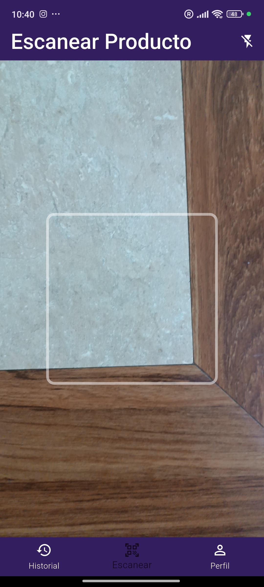<br><sub><b>Scanner</b></sub></td>
    <td align="center">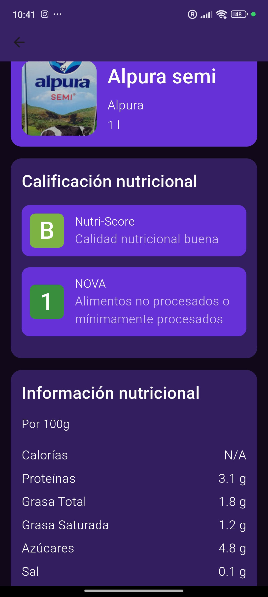<br><sub><b>Detalles de Producto</b></sub></td>
    <td align="center">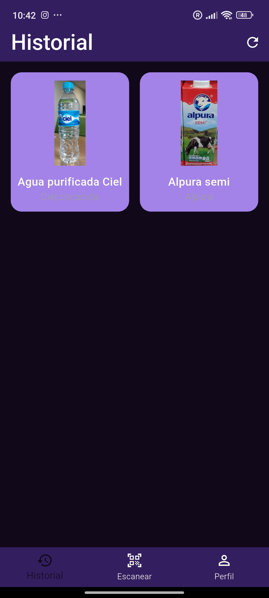<br><sub><b>Historial de Productos</b></sub></td>
  </tr>
</table>

---

## 🛠️ Tecnologías Utilizadas

<p p align="left">
  <a href="https://developer.android.com/?hl=es-419" target="_blank" rel="noopener noreferrer">
    
  </a>
  <a href="https://dart.dev/" target="_blank" rel="noopener noreferrer">
    
  </a>
  <a href="https://flutter.dev/" target="_blank" rel="noopener noreferrer">
    
  </a>
  <a href="https://firebase.google.com/" target="_blank" rel="noopener noreferrer">
    
  </a>
</p>

* **Framework:** [Flutter](https://flutter.dev/)
* **Lenguaje:** [Dart](https://dart.dev/)
* **Arquitectura:** en Capas
* **Escáner:** [mobile_scanner](https://pub.dev/packages/mobile_scanner)
* **APIs:** [Open Food Facts API](https://openfoodfacts.org/), [Firebase](https://firebase.google.com/)

---

## 📂 Estructura del Proyecto

El proyecto sigue los principios de **Clean Architecture** para separar las responsabilidades y facilitar la escalabilidad. El código está organizado por *features* (módulos), y cada uno contiene tres capas:

* **`presentation`**: Contiene los widgets (UI) y la lógica de estado.
* **`domain`**: El corazón de la aplicación. Contiene las entidades, los casos de uso y los contratos (repositorios abstractos). Es independiente de cualquier framework.
* **`data`**: Implementa los repositorios del dominio. Se encarga de obtener los datos de fuentes externas (APIs, bases de datos).

## 🚀 Empezando

Sigue estos pasos para ejecutar el proyecto en tu máquina local.

### **Prerrequisitos**

Asegúrate de tener el [SDK de Flutter](https://flutter.dev/docs/get-started/install) instalado en tu computadora.

### **Instalación**

1.  **Clona el repositorio:**
    ```sh
    git clone https://github.com/Daavid-Anaya/code4health.git
    ```
2.  **Navega al directorio del proyecto:**
    ```sh
    cd code4health
    ```
3.  **Instala las dependencias:**
    ```sh
    flutter pub get
    ```
4.  **Ejecuta la aplicación:**
    ```sh
    flutter run
    ```
    
---

## 📄 Licencia

Este proyecto está bajo la Licencia MIT. Consulta el archivo `LICENSE` para más detalles.
